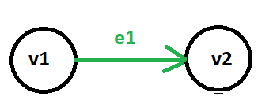
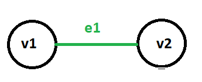
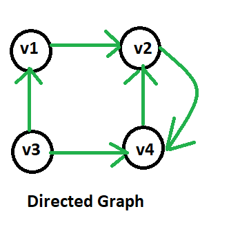
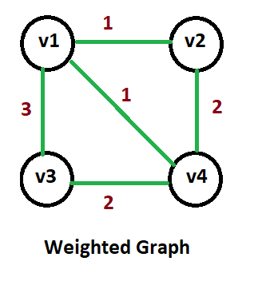
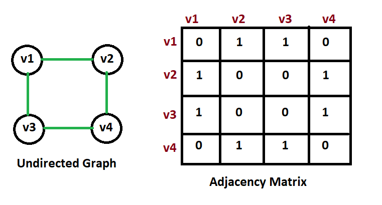
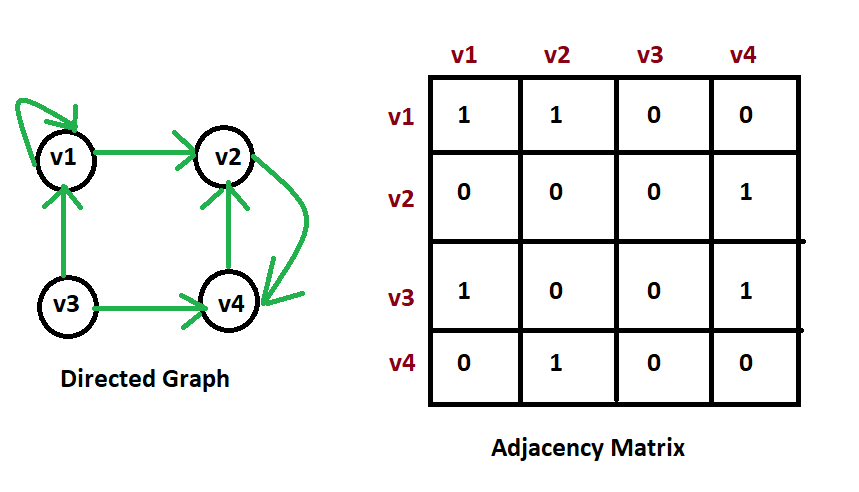
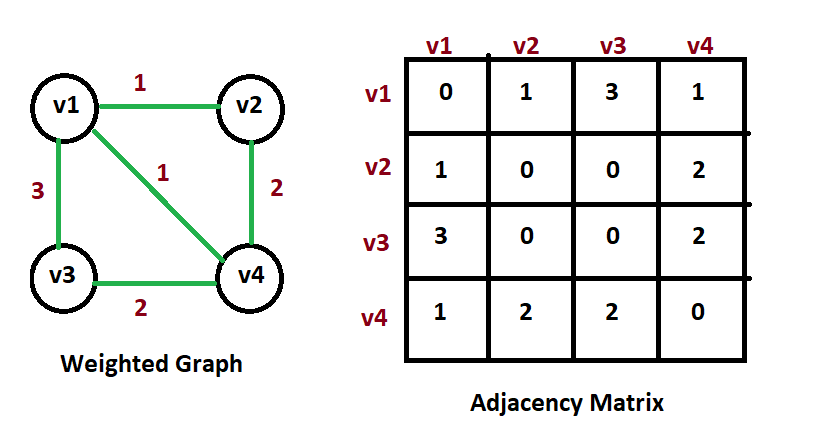

### Graphs:
A Graph is a non-linear data structure consisting of nodes and edges.  
The nodes are sometimes also referred to as vertices and the edges are lines or arcs that connect any two nodes in the graph.

**Mathematical Definition:**
A Graph consists of a finite set of vertices(or nodes) and set of Edges which connect a pair of nodes. 
        **G = (V,E)**  
          V = set of vertices = {v1,v2,v3,...vn}  
          E = set of edges and each edge represents pair of vertices  
          Directed Edge = Ordered Pair = (v1,v2) where (v1,v2) represents single direction edge.  
          Undirected Edge = Unordered Pair = {v1,v2} where {v1,v2} represents bi-directional edge.   
          
**For Example:**   
            **G=(V,E)**  
            V = {v1,v2,v3}  
            Ordered Pairs of edges= (v1,v2),(v1,v3)(v2,v3)   
            Unordered Pairs of edges = {v1,v2}{v1,v3}{v2,v1}{v2,v3}{v3,v1}{v3,v1}  
            

**Nodes/Vertices:**  
These are the most important components in any graph. Nodes are entities whose relationships are expressed using edges. 
**Edges:**  
Edges are used to represent the relationships between various nodes in a graph.  
An edge between two nodes expresses a one-way or two-way relationship between the nodes. 
#### Directed Edge:
The edge(e1) between ordered pair of vertices(v1,v2) called directed edge.The edge points in a single direction. 
 
First vertex v1 is the origin, Second vertex v2 is the destination. 

**Example:** One way road traffic.

#### Undirected Edge:
The edge(e1) between the unordered pair of vertices{v1,v2} called undirected edge.The edge doesn't point any specific direction.  
      
**Example:** railway lines  

### Types of Graphs:

#### Directed Graphs:
A directed graph is a graph in which all the edges are uni-directional i.e. the edges point in a single direction. 

**Example:** Route networks

#### Undirected Graphs:
An undirected graph is a graph in which all the edges are bi-directional i.e. the edges do not point in any specific direction.  

**Example:**  Highway networks, flight networks  

#### Weighted Graphs:
In a weighted graph, each edge is assigned a weight or cost. 
Consider a graph of 4 nodes as in the diagram below.  

  

As you can see each edge has a weight/cost assigned to it.  
If you want to go from vertex 1 to vertex 4, you can take one of the following 3 paths: 
1 -> 2 -> 4  
1 -> 4  
1 -> 3 -> 4  
Therefore the total cost of each path will be as follows:   
- The total cost of 1 -> 2 -> 4 will be (1 + 2) i.e. 3 units   
- The total cost of 1 -> 4 will be 1 unit   
- The total cost of 1 -> 3 -> 4 will be (3 + 2) i.e. 5 units  

#### Cyclic Graph:
A graph is cyclic if the graph comprises a path that starts from a vertex and ends at the same vertex.  
That path is called a cycle. An acyclic graph is a graph that has no cycle.  

#### Applications of Graphs:
- Representing relationships between components in electronic circuits.
- Transportation networks: Highway Networks, Flight Networks
- Computer Networks: Local Area Network(LAN), Internet, Web
- Databases: for representing ER (Entity Relationship) diagrams in databases, for representing dependency of tables in databases.

#### Trees vs Graphs:
- A tree is an undirected graph in which any two vertices are connected by only one path. 
- A tree is an acyclic graph and has N - 1 edges where N is the number of vertices. 
- Each node in a graph may have one or multiple parent nodes. 
- In a tree, each node (except the root node) comprises exactly one parent node.
- A tree cannot contain any cycles or self loops.
- A graph can have self loops and cycles

#### Graph Representation:
You can represent a graph in many ways. The two most common ways of representing a graph is as follows:  
1. Adjacency matrix  
2. Adjacency list  

#### 1. Adjacency Matrix:
To represent graphs, we need the number of vertices, the number of edges and also their interconnections. 
Adjacency Matrix is a 2D array of size V x V where V is the number of vertices in a graph.  
Let the 2D array be adj[][], a slot adj[i][j] = 1 indicates that there is an edge from vertex i to vertex j, otherwise it will set to 0.  
Adjacency matrix for undirected graph is always symmetric.  
For Undirected graphs, an edge from **i** to **j** is represented by 1 for both Adj[i,j] and Adj[j,i]. i.e Adj[i,j] = Adj[j,i] = 1.   
If a graph is a directed graph then we need to mark only one entry in the adjacency matrix.  
 **For example:** 
    If there is a directed edge from **vertex i** to **vertex j** then we set adj[i,j] = 1 and we set for Adj[j,i] = 0.  

Adjacency Matrix is also used to represent weighted graphs. If adj[i][j] = w, then there is an edge from vertex i to vertex j with weight w.  
If there is a self loop means if an edge refers from vertex **i** to itself then will set Adj[i,i] = 1.  
 
##### Adjacency Matrix for Undirected Graph:

See below diagram for undirected graph adjacency matrix.  

  

[Source Code Implementation](#)

##### Adjacency Matrix for Directed Graph:
 
See below diagram for directed graph adjacency matrix.  

[Source Code Implementation](#) 

##### Adjacency Matrix for Weighted Graph:

See below diagram for weighted graph adjacency matrix.  

[Source Code Implementation](#) 

