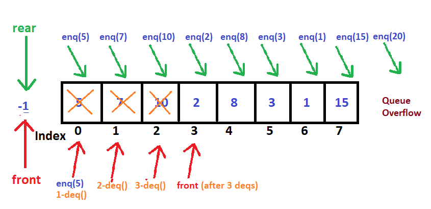
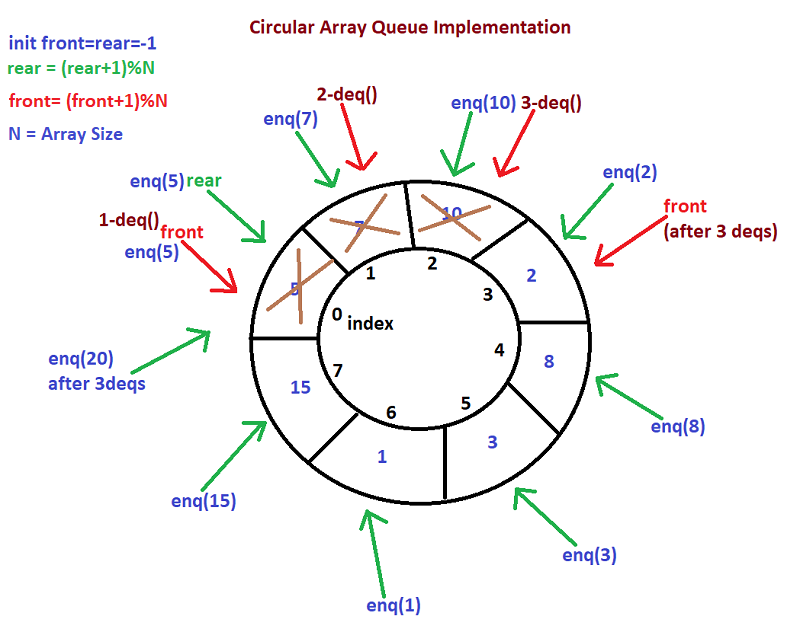

### Queue:
A queue is an ordered list in which insertions are done at one end(rear) and deletions are done at other end(front).
 
It follows First-In-First-Out(FIFO) or Last-In-Last-Out(LILO) mechanism to store and delete the elements.
 
Similar to stacks, special names are given for queue operations like enqueue and dequeue.

#### Queue ADT:
For simplicity assume the elements are integers
1. **Main Queue Operations:** 
    - **enQueue(int data):** Inserts an element at teh end of the queue
    - **int deQueue():** Removes and returns the element at the front of the queue.  

2. **Auxiliary Queue Operations:** 
    - **int front():** Returns the element at the front without removing it
    - **int size():** Returns the number of elements stored in the queue.
    - **boolean isEmpty():** Return whether queue is empty or not
    
#### Exceptions:

- **Empty Queue Exception:** If we try to do dequeue on empty queue then it throws Empty Queue Exception
- **Full Queue Exception:** If we try to enqueue on full queue then it throws Full Queue Exception.

#### Queue usages in Real World Applications:

- Operating Systems schedule jobs(with equal priority) in the order of arrival (eg. a print queue) 
- Any First-Come First-Served scenarios requires a queue.
- Asynchronous data transfer (file IO, pipes, sockets)
- Waiting times of customers at call center
- Auxiliary data structure for algorithms
- Component of other data structures

### Queue Implementations:
There are many ways of implementing queue operations(ADT). some of the commonly used methods are.

1. Simple circular array based implementation  
2. Dynamic circular array based implementation  
3. Linked List implementation <rb>

1. **Simple circular array based implementation:**  

#### Why circular arrays?
Before discussing about circular arrays, let see why don't we use simple arrays.

##### Simple Array based Queue implementation:
In queue insertions are performed at one end called rear and  deletions are performed other end called front. After performing some insertions and deletions the process becomes easy to understand. let us see with an example. 
**For Example:** 
Lets assume we have taken simple array with size 8. We have to use two variables to keep track of start element (front) and end element (rear). 
  

- Initially both front and rear elements will be pointing to -1. 
- After first insertion both front and rear points to first element of an array. 
- From second insertion on wards only rear point will be incremented by one.  
- If we delete any element then only front point will be incremented by one. 
- As per above diagram 8 elements are added in the array so rear points to 7th index and 3 elements(0,1,2 indexes) are deleted so front points to 3rd index. 
- Even though  first 3 indexes(0,1,2) are free, if we try to add an element of 20 (enq(20)) in to the array it throws full queue exception . 

**Conclusion:** 
If we use simple array for queue implementation the initial slots of array is getting wasted. So simple array implementation for queue is not efficient. To solve this problem we assume that arrays are circular arrays.
That means we treat the last element and first element of the array are contiguous. If this representation, if there are any free slots at the beginning, the rear pointer can easily go to the next free slot. 

#### Circular Array based Queue implementation:
In circular array we treat first element and end elements are contiguous. That means if there are any free slots at the beginning, the rear pointer can easily go to the next free slot.  

##### how to increment front and rear points in circular array?
- In circular array initially front and rear points to -1. 
- After adding first element into the array both front and rear points to index 0.
- From 2nd element insertion onwards rear will increment by (rear+1)%ArraySize.
- For each deletion of the element front index will be changed to (front+1)%ArraySize. 

**why not normal increment?**  
If you consider above diagram we have taken circular array with size 8. On empty queue both front and rear points to index -1. For first insertion both front and rear incremented by one. 
From second insertion onwards rear will be incremented by (rear+1)%N. because if you assume we have added all the elements in the array means 8 elements we have added now the rear points to index 7,
and 3 elements are deleted so front points to index 3. Now if you want to add an element 20 (enq(20)) to the queue then it should take next free slot in circular array which is index 0. for that if
we do normal increment by one then rear will be index 8 which exceeds the total array size ( which is index from 0-7). 
To insert  9th element in circular array we have to get next free slot which is 0th index, to get that we have to calculate the rear by (rear+1)%ArraySize.
Before 9th element insertions rear will be pointing to 7th index, next free slot is index 0. To calculate next rear point use `(7+1)%8 => 8%8 => 0(remainder)`. So next rear will be 0th index.

**how remainder of array size works?** 
`i%num = i for all i < num`  
`i%num = 0 for i == num `  
 **For example:** 
 Array size = 8 
 first enq rear = 0 
 second enq `rear = (0+1)%8 = 1%8 = 1(remainder)` 
 below of 8 all the numbers remainder will be the same number, e.g `2%8=2, 3%8=3, 4%8=4, 5%8=5, 6%8=6`  
 for 8th enq rear = (6+1)%8 = 7%8 = 7  
 for 9th enq rear = (7+1)%8 = 8%8 = 0(remainder)  
 After inserting from 0 to 7 indexes next insertion should be cyclic means it has to go from 0 th 7 indexes again.  
 Same for deq() or deletion operations as well.  
 
 

 