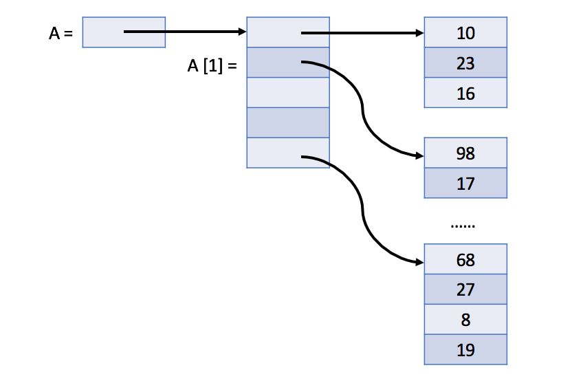

# 2D Array

Similar to a one-dimensional array, a two-dimensional array also consists of a sequence of elements. 
But the elements can be laid out in a rectangular grid rather than a line.

- In Java, the two-dimensional array is actually a one-dimensional array which contains M elements, each of which is an array of N integers.

The picture below shows the actual structure of a two-dimensional array A in Java:

 

 