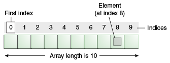

# Arrays
Arrays are used to store collection of elements which are same type and elements will be stored in continuous memory location.

- We can access elements with constant time.
- The length of an array is established when the array is created. After creation, its length is fixed
- Array in Java is index-based, the first element of the array is stored at the 0th index, 2nd element is stored on 1st index and so on.

  

- In Java, array is an object of a dynamically generated class.
- Java array inherits the Object class, and implements the Serializable as well as Cloneable interfaces.
- We can store primitive values or objects in an array in Java.
- Java array can be also be used as a static field, a local variable, or a method parameter.
- The size of an array must be specified by int or short value and not long.
- The direct superclass of an array type is Object.
- An array can contain primitives (int, char, etc.) and object (or non-primitive) references of a class depending on the definition of the array.
- In the case of primitive data types, the actual values are stored in contiguous memory locations.
- In the case of class objects, the actual objects are stored in a heap segment.
- If array is created by using new operator then array will be filled with array type default values. which is like zero (for numeric types), false (for boolean), or null (for reference types).
### Creating, Initializing, and Accessing an Array:


```java
 public class ArrayDemo {
    public static void main(String args[]) {
        int[] ary1;
        int[] ary2 = new int[5];
        // int ary3[5] = new int[]; //invalid
        //ary1 = new int[4]; error: variable ary1 might not have been initialized
        int ary4[] = {10,20,30,40}; //Here the length of the array is determined by the number of values provided between braces and separated by commas.
        int ary5[] = new int[]{5,10,15}; // array literal
        ary2[0] = 1;
        ary2[1] = 2;
        System.out.println("All Arrays are initialized");
        System.out.println("ary1-size:"+ary1.length);
        System.out.println("ary2-size:"+ary2.length);
        //  System.out.println("ary3-size:"+ary3.length);
        System.out.println("ary4-size:"+ary4.length);
        System.out.println("ary5-size:"+ary5.length);
    }
}
```

### Array's Capacity vs Length:
The Array's capacity must be decided when the Array is created. The capacity cannot be changed later.
The capacity of an Array in Java can be checked by looking at the value of its length attribute. This is done using the code arr.length, where arr is the name of the Array.
````java
int[] array = new int[6]
int capacity = array.length;
System.out.println("The Array has a capacity of " + capacity); // Output: 6
````

The other definition of length is the number of integers, or other items, currently in the Array.
This is something you'll need to keep track of yourself, and you won't get any errors if you overwrite an existing integer, or if you leave a gap in the Array.

````java
// Create a new array with a capacity of 6.
int[] array = new int[6];

// Current length is 0, because it has 0 elements.
int length = 0;

// Add 3 items into it.
for (int i = 0; i < 3; i++) {
    array[i] = i * i;
    // Each time we add an element, the length goes up by one.
    length++;
}

System.out.println("The Array has a capacity of " + array.length);
System.out.println("The Array has a length of " + length);
````

### Multi-Dimensional Arrays:
You can also declare an array of arrays (also known as a multidimensional array) by using two or more sets of brackets, such as String[][] names.
In the Java programming language, a multidimensional array is an array whose components are themselves arrays.

```java
class MultiDimArrayDemo {
    public static void main(String[] args) {
        String[][] names = {
                {"Mr. ", "Mrs. ", "Ms. "},
                {"Smith", "Jones"}
        };
        // Mr. Smith
        System.out.println(names[0][0] + names[1][0]);
        // Ms. Jones
        System.out.println(names[0][2] + names[1][1]);
    }
}
```

### What is the class name of Java array?
In Java, an array is an object. For array object, a proxy class is created whose name can be obtained by **getClass().getName()** method on the object.

```java
//Java Program to get the class name of array in Java 

class Testarray4{  
    public static void main(String args[]){  
        //declaration and initialization of array  
        int arr[]={4,4,5};  
        //getting the class name of Java array  
        Class c=arr.getClass();  
        String name=c.getName();  
        //printing the class name of Java array   
        System.out.println(name);
    
    }
}

```

### Cloning an Array in Java
Since, Java array implements the Cloneable interface, we can create the clone of the Java array. If we create the **clone of a single-dimensional array, it creates the deep copy** of the Java array.
It means, it will copy the actual value. But, if we create the **clone of a multidimensional array, it creates the shallow copy** of the Java array which means it copies the references.
```java
//Java Program to clone the array  
class Testarray1{  
public static void main(String args[]){  
int arr[]={33,3,4,5};  
System.out.println("Printing original array:");  
for(int i:arr)  
System.out.println(i);  
  
System.out.println("Printing clone of the array:");  
int carr[]=arr.clone();  
for(int i:carr)  
System.out.println(i);  ****
  
System.out.println("Are both equal?");  
System.out.println(arr==carr);  
  
}}
```
### Copying Array
The System class has an arraycopy method that you can use to efficiently copy data from one array into another:

```java
public static void arraycopy(Object src, int srcPos, Object dest, int destPos, int length)

```
For our convenience, Java SE provides several methods for performing array manipulations (common tasks, such as copying, sorting and searching arrays) in the **java.util.Arrays** class.

### Some other useful operations provided by methods in the java.util.Arrays class are:

- Searching an array for a specific value to get the index at which it is placed (the binarySearch method).

- Comparing two arrays to determine if they are equal or not (the equals method).

- Filling an array to place a specific value at each index (the fill method).

- Sorting an array into ascending order. This can be done either sequentially, using the sort method, or concurrently, using the parallelSort method introduced in Java SE 8. Parallel sorting of large arrays on multiprocessor systems is faster than sequential array sorting.

- Creating a stream that uses an array as its source (the stream method). For example, the following statement prints the contents of the copyTo array in the same way as in the previous example:

- java.util.Arrays.stream(copyTo).map(coffee -> coffee + " ").forEach(System.out::print);

    - Converting an array to a string. The toString method converts each element of the array to a string, separates them with commas, then surrounds them with brackets. For example, the following statement converts the copyTo array to a string and prints it:

      System.out.println(java.util.Arrays.toString(copyTo));
      This statement prints the following:
      [Cappuccino, Corretto, Cortado, Doppio, Espresso, Frappucino, Freddo]

### Jagged Arrays:
A jagged array is an array of arrays such that member arrays can be of different sizes, i.e., we can create a 2-D array but with a variable number of columns in each row. These types of arrays are also known as Jagged arrays.

```java
int arr_name[][] = new int[][]  {
                                  new int[] {10, 20, 30 ,40},
                                  new int[] {50, 60, 70, 80, 90, 100},
                                  new int[] {110, 120}
                                      };
                                      
                              OR                                     
                                                         
int[][] arr_name = {
      new int[] {10, 20, 30 ,40},
      new int[] {50, 60, 70, 80, 90, 100},
      new int[] {110, 120}
          };
                              
                              OR                                     
                                                         
int[][] arr_name = {
       {10, 20, 30 ,40},
       {50, 60, 70, 80, 90, 100},
       {110, 120}
       };
```

### Disadvantages of Arrays:

- fixed size. The size of the array should be specified before using it

- Memory will be allocated based on array size and memory will be wasted if elements are empty

- continuous memory allocation: Sometimes it will be difficult to accomodate continuous memory block for larger arrays.

- complex position based insertions: To insert the element in the middle then we have shift to existing elements.

**For Example:**<br>

`int[] ary = new int[100];`

100 continuous memory locations will be allocated to array. If we store only 10 values then remaining 90 locations will be wasted.


## Dynamic Arrays:

Dynamic Arrays will solve the fixed size issue in Arrays. It also called as **growable array, resizable array, dynamic table, or array list**

### How to implement Dynamic Arrays?
Simple way of implementing dynamic arrays is to initially start with some fixed size array.As soon as array becomes full, create the new array with double size of the original array.

**Source:**
1. https://www.geeksforgeeks.org/arrays-in-java/
2. https://docs.oracle.com/javase/tutorial/java/nutsandbolts/arrays.html
3. 