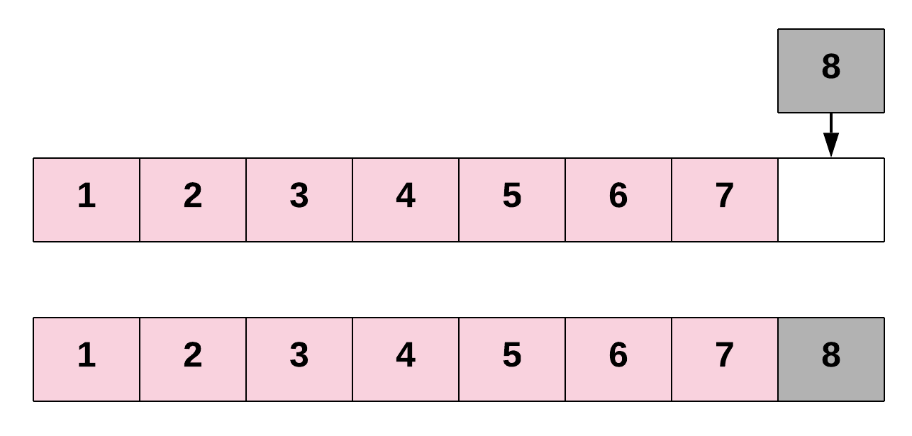
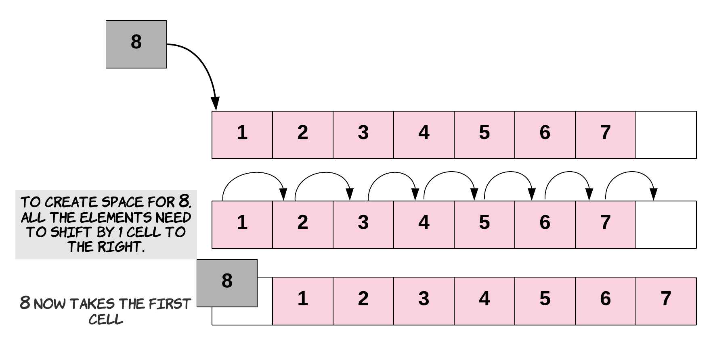
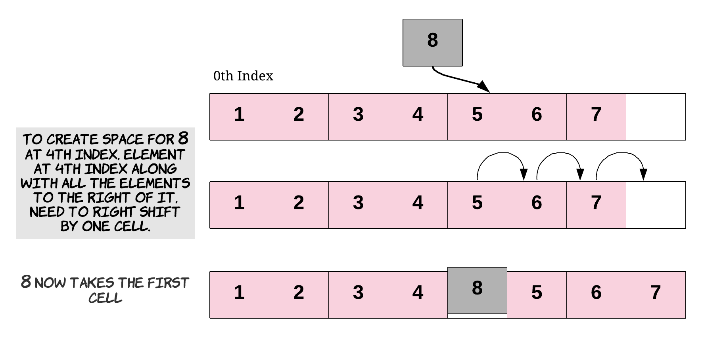
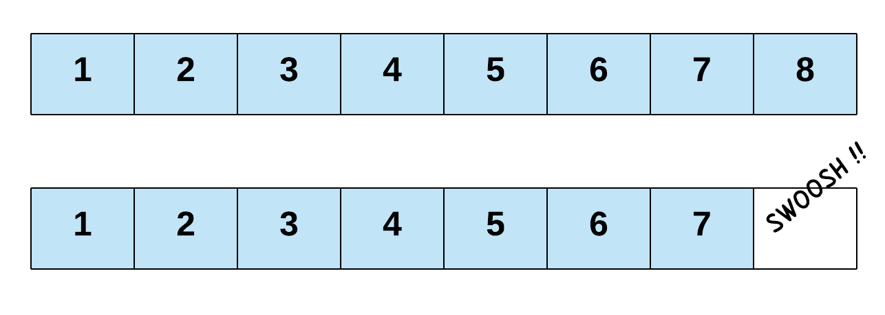
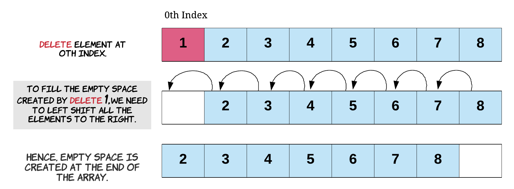
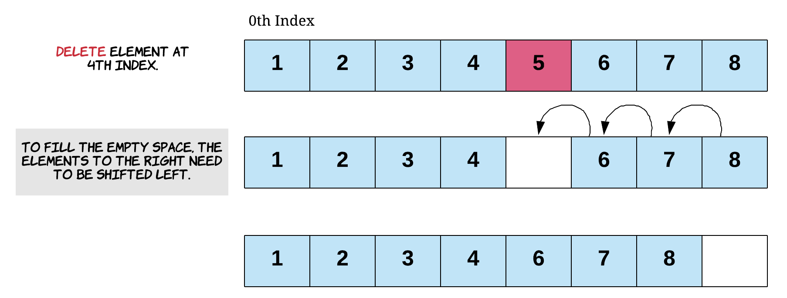
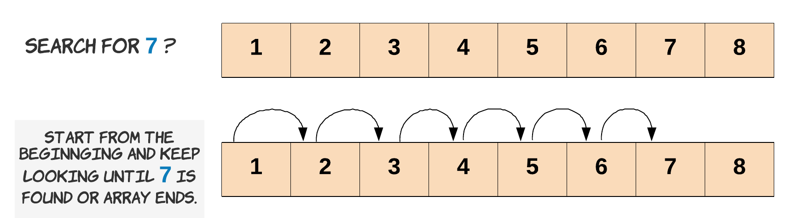

# Array Operations

An Array is a data structure, which means that it stores data in a specific format and supports certain operations on the data it stores.

In this section, we'll be looking at the three basic operations that are supported by almost every data structure:

1. **insertion:**  Insert a new element into the array at a specific location.
2. **deletion:** Delete an element from the existing array.
3. **search:** Search for a particular element in the array.

## 1. insertion:
Inserting a new element into an Array can take many forms:

    1.1 Inserting at the end of the Array.
    1.2 Inserting at the beginning of the Array.
    1.3 Inserting at any given index.

#### 1.1 Inserting at the end of the Array
There are two ways to do this operation.


**Approach-1:** 
Maintaining the length flag to hold elements count irrespective of array's capacity.

 At any point in time, we know the index of the last element of the Array, as we've kept track of it in our length variable.


```java
//Approach-1:
public class ArrayOperations {
    public void insertElementAtEnd_WithLengthFlag() {
        int[] squares = new int[10];
        int length = 0;
        for (int i = 0; i < 5; i++) {
            squares[i] = (i + 1) * (i + 1);
            length++;
        }
        System.out.println("Before insert: " + Arrays.toString(squares));
        squares[length++] = 36;
        System.out.println("After insert: " + Arrays.toString(squares));
    }
}
```

**Approach-2:**
As per java length is same as capacity. Based on the array length, adding the element at the last index.

```java
//Approach-2:
public class ArrayOperations {
    private void insertElementAtEnd() {
        int[] squares = new int[10];
        for(int i=0;i<5;i++){
            squares[i] = (i+1)*(i+1);
        }
        System.out.println("Before insert: "+ Arrays.toString(squares));
        squares[squares.length-1] = 36;
        System.out.println("After insert: "+ Arrays.toString(squares));
    }
}
```
#### 1.2. Inserting at the beginning of the Array



- To insert an element at the start of an Array, we'll need to shift all other elements in the Array to the right by one index to create space for the new element. 
- This is a very costly operation and this is not a constant time operation. 
- In fact, the time taken for insertion at the beginning of an Array will be proportional to the length of the Array. 
- In terms of time complexity analysis, this is a linear time complexity: O(N) where N is the length of the Array.

#### 1.3. Inserting at any given index


- Similarly, for inserting at any given index, we first need to shift all the elements from that index onwards one position to the right. 
- Once the space is created for the new element, we proceed with the insertion. 
- If you think about it, insertion at the beginning is basically a special case of inserting an element at any index there given index was 0.
- Again, this is also a costly operation since we could potentially have to shift almost all the other elements to the right before actually inserting the new element. 
- Shifting lots of elements one place to the right adds to the time complexity of the insertion task.

**Note:**
- The main thing to be careful of is remembering that array.length gives you the total capacity of the Array.
- If you want to know the last used slot, you'll need to keep track of this yourself using a length variable.
- All the insertions operations are implemented as part of [ArrayInsertionOperations.java]()

## 2. Array Deletions:
Deletion in an Array works in a very similar manner to insertion, and has the same three different cases:
    2.1. Deleting the last element of the Array.
    2.2. Deleting the first element of the Array.
    2.3. Deletion at any given index.
All the deletion operations are performed in two ways, one is maintaining the length flag to track next index  and the other is length == capacity

**Different ways to delete an array elements:**
Even though we call it a deletion, it's not like we actually freed up the space for a new element
1. Simply overwriting the value at a certain index deletes the element at that index.Overwrite the existing element with either new value or default value
2. Maintain the length variable in our examples tells us the next index where we can insert a new element, reducing it by one ensures the next new element is written over the deleted one.

#### 2.1 Deleting the last element of the Array:


- Deletion at the end of an Array is similar to people standing in a line, also known as a queue. 
- last element can be deleted an array without disturbing the rest of array elements.

#### 2.2 Deleting From the Start of an Array
- The costliest of all deletion operations for an Array is deleting the first element. 
- If we want to delete the first element of the Array, that will create a vacant spot at the 0th index. 
- To fill that spot, we will shift the element at index 1 one step to the left. 
- This shift of elements takes O(N) time, where N is the number of elements in the Array.



- Starting from index 0, we'll move every element one position to its left, effectively "deleting" the element at index 0. 
- We also need to reduce length by 1 so that the next new element is inserted in the correct position.

#### 2.3 Deleting From Anywhere in the Array



- For deletion at any given index, the empty space created by the deleted item will need to be filled. 
- Each of the elements to the right of the index we're deleting at will get shifted to the left by one. 
- Deleting the first element of an Array is a special case of deletion at a given index, where the index is 0.
- This shift of elements takes O(K) time, where K is the number of elements to the right of the given index. 
- Since potentially K = N, we say that the time complexity of this operation is also O(N).

**Note:**
- delete operations are implemented as part of [ArrayDeletionOperations]()


## 3. Searching:
 
- Searching means to find an occurrence of a particular element in the Array and return its position. 
- We might need to search an Array to find out whether an element is present in the Array.
- We might also want to search an Array that is arranged in a specific fashion to determine which index to insert a new element at.
- If we know the index in the Array that may contain the element we're looking for, then the search becomes a constant time operation—we simply go to the given index and check whether the element is there.

There's more than one way of searching an Array.
    3.1. Linear Search
    3.2. Binary Search

#### 3.1 Linear Search
- If the index is not known, which is the case most of the time, then we can check every element in the Array. 
- We continue checking elements until we find the element we're looking for, or we reach the end of the Array. 
- This technique for finding an element by checking through all elements one by one is known as the linear search algorithm. 
- In the worst case, a linear search ends up checking the entire Array.
- Therefore, the time complexity for a linear search is O(N).



Let's see the linear search algorithm in action, with all the edge cases handled properly. 
When we say edge cases, we basically mean scenarios that you wouldn't expect to encounter.
For example, 
- the element you're searching for might not even exist in the Array. 
- Possible scenario is that the input Array doesn't contain any elements at all
- Perhaps it is null. 
- It's important to handle all of these edge cases within the code.

```java
public class ArrayLinearSearch {
    public static boolean linearSearch(int[] array, int length, int element) {
        // Check for edge cases. Is the array null or empty?
        // If it is, then we return false because the element we're
        // searching for couldn't possibly be in it.
        if (array == null || length == 0) {
            return false;
        }

        // Carry out the linear search by checking each element,
        // starting from the first one.
        for (int i = 0; i < length; i++) {
            // We found the element at index i.
            // So we return true to say it exists.
            if (array[i] == element) {
                return true;
            }
        }

        // We didn't find the element in the array.
        return false;
    }
}

```


There are many variations to this algorithm:
1. Returning the first location
2. Return last location
3. Return all the locations (an element could be in the Array more than once).

#### 3.2 Binary Search

- If the elements in the Array are in sorted order, then we can use binary search. 
- Binary search is where we repeatedly look at the middle element in the Array, and determine whether the element we're looking for must be to the left, or to the right. 
- Each time we do this, we're able to halve the number of elements we still need to search, making binary search a lot faster than linear search!
- The downside of binary search though is that it only works if the data is sorted. 
- If we only need to perform a single search, then it's faster to just do a linear search, as it takes longer to sort than to linear search. 
- If we're going to be performing a lot of searches, it is often worth sorting the data first so that we can use binary search for the repeated searches.
- You can find out more about binary search on our [Binary Search Explore Card](https://leetcode.com/explore/learn/card/binary-search/).

**Note:**
- Array search operations are implemented as part of [ArraySearchOperations.java]()
