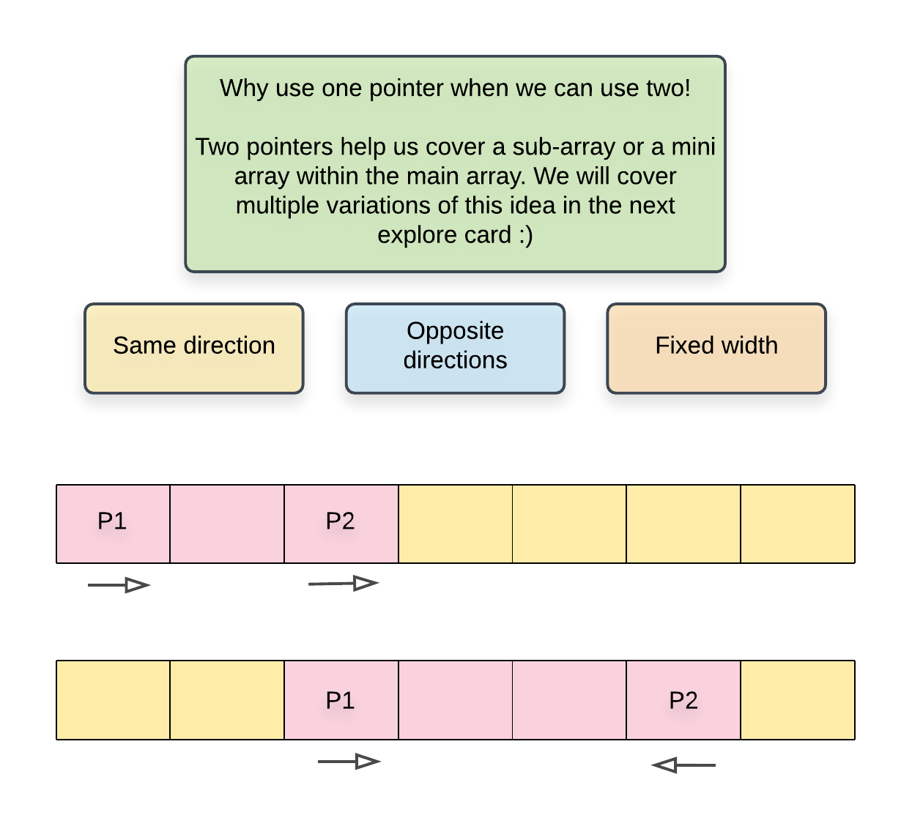
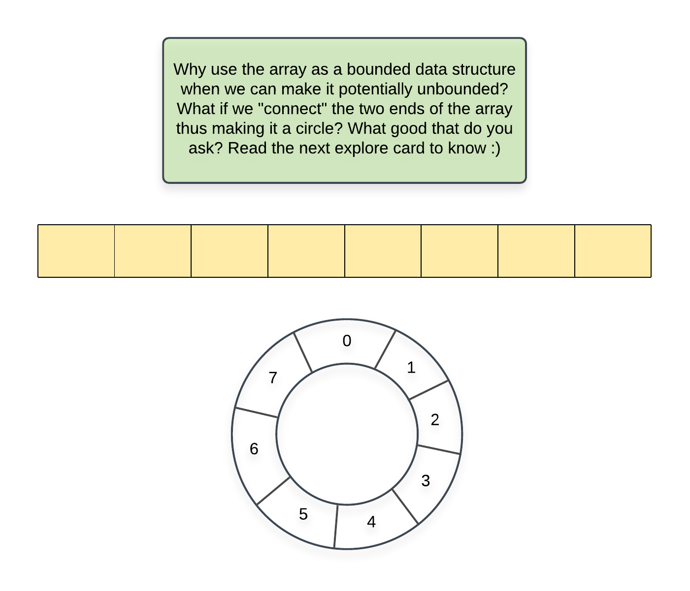

# Arrays Summary:
Let's recap what we looked at in this explore card:

- Array data structure
- Java syntax for creating Arrays.
- Array Operations: insertion, deletion, search, accessing array elements
- In-place Array algorithms.
- Other techniques:
  - Two-Pointer Array
  - Circular Array

#### Two-Pointer

#### Circular Array:

