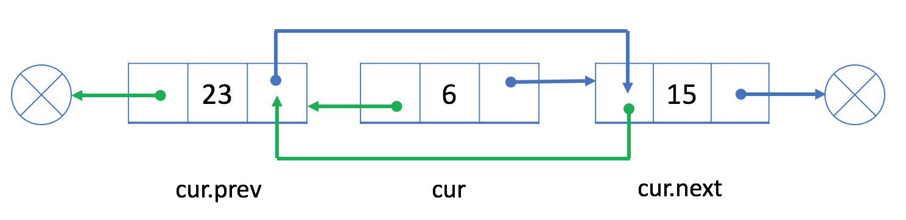

# Doubly Linked List

- The doubly linked list works in a similar way to singly linked list but has one more reference field which is known as the "prev" field. 
- With this extra field, you are able to know the previous node of the current node.

Let's take a look at an example:

- Similar to the singly linked list, we will use the head node to represent the whole list.

## Operations
Similar to a singly linked list
- Traverse 
- Insertion Operations
- Delete Operations

### Traversing Doubly Linked List:
- We can access data in the same exact way as in a singly linked list:
- We are not able to access a random position in constant time.
- We have to traverse from the head to get the i-th node we want.
- The time complexity in the worse case will be O(N), where N is the length of the linked list.

### Insertion Operations:
##### Insert after target node:
If we want to insert a new node after an existing node, we can divide this process into two steps:
- Let's add a new node 9 after the existing node 6:

- link curr_Sll_node (node 9) with prev_node (node 6) and next_node (node 15)
- re-link prev_node (node 6) and next_node (node 15) with curr_Sll_node (node 9)

- Similar to the singly linked list, both the time and the space complexity of the add operation are O(1).
- similarly we can insert a new node at the beginning or at the end

### Delete Operation

- If we want to delete an existing node from the doubly linked list
- we can simply link its previous node to prev, with its next node to next.
- Unlike the singly linked list, it is easy to get the previous node in constant time with the "prev" field.
- Since we no longer need to traverse the linked list to get the previous node, both the time and space complexity are O(1).

##### An Example:

- Our goal is to delete the node 6 from the doubly linked list.

- So we link its previous node 23 and its next node 15:

- Node 6 is not in our doubly linked list now.

- similarly we can delete the first node or the last node in the list.

 