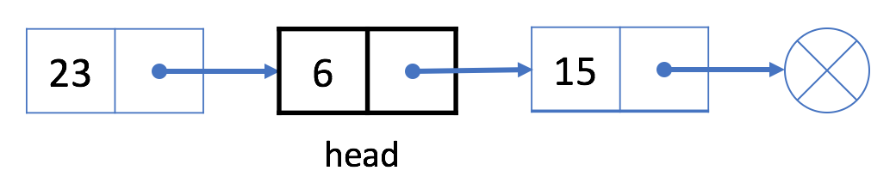

# Singly Linked List(SLL)
- Each node in a singly-linked list contains not only the value but also a reference field to link to the next node. 
- By this way, the singly-linked list organizes all the nodes in a sequence.

- The above diagram shows how nodes in a singly linked list are connected.
- Unlike the array, we are not able to access a random element in a singly-linked list in constant time.
- If we want to get the ith element, we have to traverse from the head node one by one.
- It takes us O(N) time on average to visit an element by index, where N is the length of the linked list.

- For instance, in the example above, 
  - The head is the node 23. 
  - The only way to visit the 3rd node is to use the "next" field of the head node to get to the 2nd node (node 6); 
  - Then with the "next" field of node 6, we are able to visit the 3rd node.
- You might wonder why the linked list is useful though it has such a bad performance (compared to the array) in accessing data by index. 
- Let's see insert and delete operations, you will realize the benefit of the linked list.

## Singly Linked List Operations:
1. Insert Operations (at start, at given index and at end)
2. Delete Operations (at start, at given index and at end)
3. Search Operations

### 1. Insert Operations
Insertion steps for Linked List:
- create a new node to insert
- find the previous node and next node for the given index
- update previous node's next pointer to new node
- update new node's next pointer to next node

#### 1.1 insert an element at start of the linked list:
- we use the head node to represent the whole list.
- So it is essential to update head when adding a new node at the beginning of the list.
**steps:**
- initialize a new node new_Sll_node;
- link the new node to our original head node.
- assign new_Sll_node to head.

**For example:**

let's add a new node 9 at the beginning of the list.

- initialize a new node 9 
- link node 9 to current head node 23
- assign node 9 to be our new head

#### 1.2 insert an element at given index:

Let's insert a new value 9 after the second node 6.

- first initialize a new node with value 9. 
- link node 9 to node 15. 
- Finally, link node 6 to node 9.

#### 1.3 insert an element at end:

Let's insert a new value 9 at the end of linked list

- first initialize a new node with value 9.
- find the last element of the linked list by using next pointer == NULL
- link node 15 to node 9.
- Finally, link node 9 to **NULL**.

### 2. Delete Operations (at start, at given index and at end)
- If we want to delete an existing node from the singly linked list, we can do it in two steps:
- find current_Sll_node's previous node and current_Sll_node's next node
- link previous_node to current_Sll_node's next node.

**Analysis:**
- In our first step, we need to find out prev_node and next_node.
- It is easy to find out next using the reference field of curr_Sll_node.
- However, we have to traverse the linked list from the head node to find out prev_node which will take O(N) time on average, where N is the length of the linked list. 
- So the time complexity of deleting a node will be O(N).
- The space complexity is O(1) because we only need constant space to store our pointers.

#### 2.1 Delete the First Node:
- If we want to delete the first node, the strategy will be a little different.
- we use the head node to represent a linked list. 
- Our head is the black node 23 in the example below.
 

- If we want to delete the first node, we can simply assign the next node to head. 
- That is to say, our head will be node 6 after deletion.

- The linked list begins at the head node, so node 23 is no longer in our linked list.

#### 2.2 Delete the given node:

Let's try to delete node 6 from the singly linked list above.

- Traverse the linked list from the head until we find the previous node which is node 23
- Link prev (node 23) with node 6's next (node 15)

- Node 6 is not in our singly linked list now.

#### 2.3 Delete at the end

Let's try to delete last node(node 15) from the singly linked list above.

- Traverse the linked list from the head until the last node 15
- Link prev (node 6) with node 15's next which is NULL

- Node 15 is not in our singly linked list now.

## Design Linked List

- You can choose to use a singly or doubly linked list.
- A node in a singly linked list should have two attributes: val and next. 
- val is the value of the current node, and next is a pointer/reference to the next node.
- If you want to use the doubly linked list, you will need one more attribute prev to indicate the previous node in the linked list. 
- Assume all nodes in the linked list are 0-indexed.

#### Implement the MyLinkedList class:
- You can find the implementation of Singly Linked List Operations: [SinglyLinkedListOperations]()
