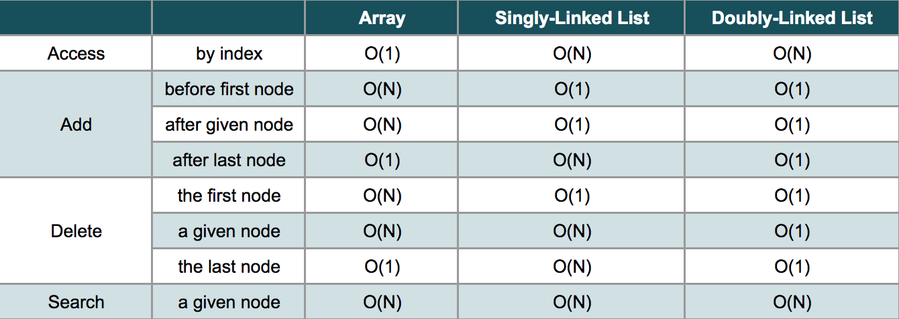

# Summary:

Both Singly Linked List and Doubly linked list both are similar in many operations:

- Both of them are not able to access the data at a random position in constant time.
- Both of them can add a new node after given node or at the beginning of the list in O(1) time.
- Both of them can delete the first node in O(1) time.
- But it is a little different to delete a given node (including the last node).
- In a singly linked list, it is not able to get the previous node of a given node so we have to spend O(N) time to find out the previous node before deleting the given node.
- In a doubly-linked list, it will be much easier because we can get the previous node with the "prev" reference field. So we can delete a given node in O(1) time.

#### Comparison
Here we provide a comparison of time complexity between the linked list and the array.

**Note:** The given time complexities for the Doubly-Linked List assume that the Doubly-Linked List implementation keeps a reference to the tail node. If a reference to the tail node is not kept, then adding a node after the last node or deleting the last node would also require O(N) time.

#### Conclusion:
- If you need to add or delete a node frequently, a linked list could be a good choice.
- If you need to access an element by index often, an array might be a better choice than a linked list.
