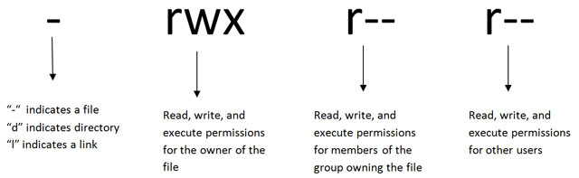

### How to change directory
permissions in Linux
To change directory permissions in Linux, use the following:
chmod +rwx filename to add permissions.
chmod -rwx directoryname to remove permissions.
chmod +x filename to allow executable permissions.
chmod -wx filename to take out write and executable permissions.
Note that “r” is for read, “w” is for write, and “x” is for execute.

This only changes the permissions for the owner of the file.

References:
1. https://www.pluralsight.com/blog/it-ops/linux-file-permissions
2. 